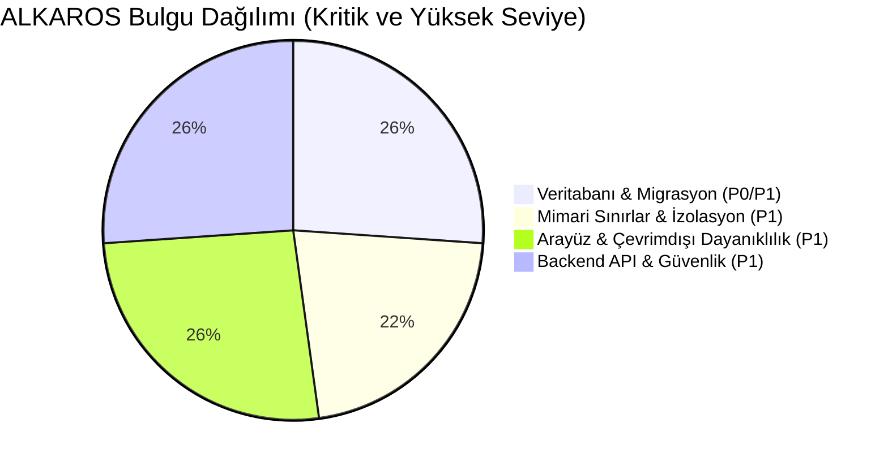

# ALKAROS KONSOLİDE BAĞIMSIZ DERİN DENETİM RAPORU
## (Independent Deep Audit Report: Boundary, Interface, Backend API & Database)

> **Denetim Tarihi:** 06 Eylül 2026  
> **Denetim Türü:** Sıfır Ön Yargılı 4 Bağımsız Uzman Ajan ile Satır Satır Statik ve Mimari İnceleme  
> **Referans Standartlar:** `AGENTS.md`, `DESIGN.md`, `CLAUDE.md`, `docs/UI_STYLE_GUIDE.md`, `plan/TASK_STANDARD.md`  
> **Kapsam:** 
> 1. Mimari Sınırlar ve Modül İzolasyonu (Boundary)
> 2. Arayüz ve İstemci Sistemleri (PosTerminal, Cashier, WaiterPwa)
> 3. Backend API Endpoint'leri ve Host Katmanı (API, Routing, Security, Idempotency)
> 4. Veritabanı, Şemalar, Migrasyonlar ve Kalıcılık (Database, Migrations, Indexing, Concurrency)

---

## 1. YÖNETİCİ ÖZETİ VE DOĞRULAMA MATRİSİ

Projede daha önce hazırlanan özet dokümanlar ve test suite'leri belirli modülleri kapsayarak yüksek başarı raporlamış olsa da, **sıfır varsayımlı ve kör noktaları da hedef alan bağımsız satır satır denetim**, sistemin 4 ana ekseninde kritik mimari ihlaller, canlı dağıtımı engelleyen konfigürasyon kopuklukları ve operasyonel riskler ortaya koymuştur.



### Özet Denetim Matrisi

| Denetim Alanı | Resmi İddia / Beklenti | Gerçek Durum (Satır Satır Denetim) | Sonuç |
| :--- | :--- | :--- | :---: |
| **Mimari Sınırlar & `.csproj`** | Modüller arası doğrudan proje referansı yasaktır. | `Kitchen->Orders`, `Billing->Orders`, `Inventory->Recipes` doğrudan referanslıdır. | ❌ **İHLAL** |
| **Şema İzolasyonu (Cross-Schema)** | Hiçbir modül başka modülün şemasına yazamaz. | `Production` ve `Purchasing`, `inventory` şemasına doğrudan `UPDATE` ve `INSERT` çalıştırmaktadır. | ❌ **İHLAL** |
| **Modül Kapsamı (Blind Spots)** | Tüm modüller `IModule` ile tescillidir. | 5 modül (`Inventory`, `Recipes`, `Production`, `Purchasing`, `Menu`) `IModule` dışındadır; mimari testlerden kaçmaktadır. | ❌ **İHLAL** |
| **Arayüz Çevrimdışı Güvenliği** | Garson PWA IndexedDB ve UUIDv7 kullanır. | Garson PWA `localStorage` ve UUIDv4 kullanmaktadır; POS Terminal çevrimdışında kilitlenmektedir. | ❌ **İHLAL** |
| **PIN Brute-Force Koruması** | 3 deneme 30s kilit, 5 deneme oturum düşürme. | Arayüzlerde PIN klavyesi dahi yoktur; sınırsız denemeye açıktır. | ❌ **İHLAL** |
| **Çekirdek POS Yetenekleri** | Coursing (Hold/Fire) ve Koltuk Bazlı Sipariş. | Sipariş giriş ekranlarında aşama ve koltuk seçimi arayüzde yer almamaktadır (sadece token var). | ❌ **İHLAL** |
| **API Token İletimi** | Garson PWA ve Terminaller API'ye erişir. | Garson PWA `Bearer <token>` göndermekte; ancak Orders hariç tüm modüller Bearer'ı reddetmektedir (401). | ❌ **İHLAL** |
| **API Güvenliği & Idempotency** | Kritik mutasyonlar idempotency ile korunur. | `submit-draft` idempotency denetlemez; yetkili indirimlerde mükerrer indirim uygulanır. | ❌ **İHLAL** |
| **Migrasyon Bütünlüğü** | Tüm migrasyonlar sıralı ve tekildir. | V1 ile V11 arasında 054, 055, 056 ID'leri çakışmaktadır (`DuplicateUp` hatası). | ❌ **KRİTİK** |
| **Canlı Dağıtım (Production Sync)** | V1.1 migrasyonları aktiftir. | `order.json` ve `compose.yaml` yalnızca V1'i çalıştırmakta; V1.1 (17 migrasyon) canlıya hiç uygulanmamaktadır. | ❌ **KRİTİK** |
| **İndeksleme Performansı** | Mesajlaşma kuyrukları indekslidir. | `inbox_messages` tablosunda claim filtresi için HİÇBİR İNDEKS yoktur; her poll Seq Scan yapmaktadır. | ❌ **KRİTİK** |
| **Denetim İmmutability** | Güvenlik logları asla silinemez. | `identity.denial_events` güvenlik günlüğü `ON DELETE CASCADE` ile kullanıcı silinince yok edilmektedir. | ❌ **KRİTİK** |

---

## 2. KATMAN 1: MİMARİ SINIRLAR VE MODÜL İZOLASYONU (BOUNDARY AUDIT)

### 2.1 Doğrulanan Sağlam Yönler
1. **BuildingBlocks İzolasyonu:** `src/BuildingBlocks/` altındaki 8 projenin tamamı hiçbir `src/Modules/` projesine bağımlı değildir. Altyapı katmanına modül iş mantığı sızmamıştır.
2. **15 Modülde Temiz Proje Ayrımı:** 18 modülden 15'i diğer modüllerin `.csproj` dosyalarını doğrudan referans göstermemektedir.
3. **Masa Operasyonlarında Outbox Bütünlüğü:** Masa transferi ve birleştirmesinde olaylar domain verisiyle aynı transaction içinde `OutboxStore.EnqueueAsync` ile kuyruğa alınmaktadır (`PostgresTableTransferRepository.cs:L316`).

### 2.2 Satır Satır Kural İhlalleri ve Bulgular

#### A. Doğrudan Proje Referansları (Direct Project References)
- **[ALKAROS.Kitchen.csproj:L10](file:///D:/PROJECT/ALKAROS/src/Modules/Kitchen/ALKAROS.Kitchen.csproj#L10):**
  ```xml
  <ProjectReference Include="..\Orders\ALKAROS.Orders.csproj" />
  ```
  *Gerekçe:* Mutfak bileti oluşturulurken Orders modülünün `Order` ve `OrderItem` aggregate sınıfları doğrudan kullanılmıştır.
- **[ALKAROS.Billing.csproj:L10](file:///D:/PROJECT/ALKAROS/src/Modules/Billing/ALKAROS.Billing.csproj#L10):**
  ```xml
  <ProjectReference Include="..\Orders\ALKAROS.Orders.csproj" />
  ```
  *Gerekçe:* Hesap bölme ve birleştirme akışında `BillItem.FromOrderItem` Orders entity'sini parametre almaktadır.
- **[ALKAROS.Inventory.csproj:L11](file:///D:/PROJECT/ALKAROS/src/Modules/Inventory/ALKAROS.Inventory.csproj#L11):**
  ```xml
  <ProjectReference Include="..\Recipes\ALKAROS.Recipes.csproj" />
  ```
  *Gerekçe:* Stok modülü birim dönüşümleri için Recipes modülü altındaki `ALKAROS.Recipes.Units` sınıfına bağımlı kılınmıştır.

#### B. Çapraz Şemaya YAZMA İhlalleri (Cross-Schema WRITE - En Ağır İhlal)
- **[ProductionStockEffectService.cs:L226, L246, L358, L395](file:///D:/PROJECT/ALKAROS/src/Modules/Production/StockEffects/ProductionStockEffectService.cs#L226):**
  `Production` modülü stok hareketlerini Inventory modülünün servislerini veya domain eventlerini kullanmadan doğrudan SQL ile manipüle etmektedir:
  ```sql
  UPDATE inventory.stock_balances ...
  INSERT INTO inventory.stock_movements (...)
  ```
- **[IPurchasingService.cs:L218-L240](file:///D:/PROJECT/ALKAROS/src/Modules/Purchasing/OrdersAndReceipts/IPurchasingService.cs#L218):**
  `Purchasing` modülü mal kabul onayında (`ReceiveGoodsAsync`) stok hareketini doğrudan SQL seviyesinde işletmektedir:
  ```sql
  INSERT INTO inventory.stock_movements (...)
  ```

#### C. Mimari Kör Noktada Kalan 5 Modül
- `Inventory`, `Recipes`, `Production`, `Purchasing` ve `Menu` modüllerinde `IModule` implementasyonu tanımlanmamıştır.
- [ModuleRegistry.cs:L18-L32](file:///D:/PROJECT/ALKAROS/src/Host/Composition/Modules/ModuleRegistry.cs#L18-L32) `DefaultCatalog` dizisinde bu modüller yer almamaktadır.
- [ALKAROS.Host.csproj:L18-L31](file:///D:/PROJECT/ALKAROS/src/Host/ALKAROS.Host.csproj#L18-L31) bu 5 modülü referans vermemektedir.
- [ModuleBoundaryTests.cs:L19-L34](file:///D:/PROJECT/ALKAROS/tests/Architecture/ModuleBoundaries/ModuleBoundaryTests.cs#L19-L34) mimari testleri ve `tools/consistency-audit/consistency_audit.py:L70-L76` denetim aracı bu 5 modülü incelemediği için ihlaller CI/CD sürecinden kaçmıştır.

#### D. Gizli Fallback ve Sessiz Veritabanı Hatası Yutma (Silent Catch)
- **[IStockCostResolver.cs:L51-L54](file:///D:/PROJECT/ALKAROS/src/Modules/Recipes/CostSnapshots/IStockCostResolver.cs#L51-L54):**
  ```csharp
  catch (PostgresException ex) when (ex.SqlState == "42P01")
  {
      return null;
  }
  ```
  PostgreSQL `undefined_table` hatası (yani Purchasing tablosunun veritabanında bulunmaması durumu) sessizce yutulmakta ve `null` dönülmektedir.

---

## 3. KATMAN 2: ARAYÜZ VE İSTEMCİ SİSTEMLERİ (INTERFACE / UI AUDIT)

### 3.1 Doğrulanan Sağlam Yönler
1. **Çift Tıklama Koruması:** `cashier-app.js:L265-L267` ve `waiter-app.js:L698-L700` üzerinde `dispatchInFlight` kilidi ile mükerrer sipariş gönderimi engellenmiştir.
2. **Müşteri Ekranı Fiyat Karartma:** [CustomerDisplay.tsx:L110-L128](file:///D:/PROJECT/ALKAROS/src/Clients/PosTerminal/src/routes/CustomerDisplay.tsx#L110) 10 saniye boyunca güncellenemeyen tutarları ekrandan otomatik gizlemektedir.
3. **Floor Plan Klavye Erişilebilirliği:** [FloorPlanWorkspace.tsx:L246-L304](file:///D:/PROJECT/ALKAROS/src/Clients/PosTerminal/src/features/tables/FloorPlanWorkspace.tsx#L246) ok tuşları, shift boyutlandırma ve R ile döndürme tam uyumludur.

### 3.2 Satır Satır Kural İhlalleri ve Bulgular

#### A. Çevrimdışı Dayanıklılık İhlali (DESIGN.md §4)
- **[waiter-app.js:L69, L269, L283](file:///D:/PROJECT/ALKAROS/src/Clients/WaiterPwa/wwwroot/waiter-app.js#L69):**
  Şartname açıkça *"Garson PWA siparişleri UUID v7 ile IndexedDB yerel kuyruğuna yazar"* demesine rağmen, kod `localStorage.setItem('alkaros_waiter_offline_queue', ...)` kullanmaktadır.
- **[waiter-app.js:L33-L41](file:///D:/PROJECT/ALKAROS/src/Clients/WaiterPwa/wwwroot/waiter-app.js#L33):**
  `randomUUID()` metodu UUID v4 (`(bytes[6] & 0x0f) | 0x40`) üretmektedir; zaman sıralı UUID v7 oluşturulmamaktadır.
- **[Cashier.tsx:L81-L85, L254](file:///D:/PROJECT/ALKAROS/src/Clients/PosTerminal/src/routes/Cashier.tsx#L81):**
  Ağ koptuğunda oturum `anonymous` yapılmakta ve `backendStatus === "offline"` ise giriş butonu `disabled` kilitlenmektedir. Kiosk çevrimdışıyken açılırsa kasiyer sisteme girememektedir.

#### B. PIN Brute-Force Mekanizması Yokluğu (DESIGN.md §4)
- Şartnamedeki "3 Hatalı Deneme: 30 saniye kilitlenme geri sayımı. 5 Hatalı Deneme: Oturumun sunucuda tamamen geçersiz kılınması" mekanizması hiçbir arayüzde bulunmamaktadır.
- [waiter-app.css:L603-L628](file:///D:/PROJECT/ALKAROS/src/Clients/WaiterPwa/wwwroot/waiter-app.css#L603) içinde `.pin-grid` ve `.btn-pin` CSS kuralları tanımlı olmasına rağmen, HTML tarafında hiçbir PIN bileşeni yoktur (Ölü CSS).

#### C. Eksik Çekirdek POS Yetenekleri (DESIGN.md §1 & §3)
- **Coursing (Hold/Fire):** Sipariş giriş ekranlarında aşama ayrımı ve Pişir/Beklet butonları yoktur; yalnızca `tokens.css` içinde atıl CSS değişkeni olarak kalmıştır.
- **Koltuk Bazlı Sipariş:** Sipariş alırken sepete ürün eklerken koltuk/ortaya seçimi yapılamamaktadır.
- **Isı Haritası (Heatmap):** DESIGN.md 20 dk / 45 dk kuralı koymuşken, [TableWorkspace.tsx:L32-L33](file:///D:/PROJECT/ALKAROS/src/Clients/PosTerminal/src/features/tables/TableWorkspace.tsx#L32) içinde 75 dk / 120 dk olarak hardcode edilmiştir ve 3 renkli durum halkası görselleştirilmemiştir.

#### D. Dil Kuralı İhlalleri ve Ham Hata Sızıntıları (UI_STYLE_GUIDE.md)
- [api.ts:L53](file:///D:/PROJECT/ALKAROS/src/Clients/PosTerminal/src/api.ts#L53), [Cashier.tsx:L156](file:///D:/PROJECT/ALKAROS/src/Clients/PosTerminal/src/routes/Cashier.tsx#L156), [CustomerDisplay.tsx:L36](file:///D:/PROJECT/ALKAROS/src/Clients/PosTerminal/src/routes/CustomerDisplay.tsx#L36) üzerinde sunucudan dönen ham `reason.message` kullanıcıya alert/toast olarak basılmaktadır.
- Ekranda basılan İngilizce terimler:
  - [TableWorkspace.tsx:L242](file:///D:/PROJECT/ALKAROS/src/Clients/PosTerminal/src/features/tables/TableWorkspace.tsx#L242): 15 farklı yerde "Bölge" yerine **"Zone"** (`"+ Zone ekle"`, `"Yeni zone"`).
  - [Cashier.tsx:L511](file:///D:/PROJECT/ALKAROS/src/Clients/PosTerminal/src/routes/Cashier.tsx#L511): `<small>Revision ...</small>` -> "Revision" kelimesi İngilizce.
  - [CatalogWorkspace.tsx:L117, L138, L142](file:///D:/PROJECT/ALKAROS/src/Clients/PosTerminal/src/features/catalog/CatalogWorkspace.tsx#L117): `"yalnızca yönetici CRUD"`, `"EFFECTIVE PRICE"`, `<option value="MenuItem">Menu item</option>`, `<option value="Modifier">Modifier</option>`, `<option value="AddOn">Add-on</option>`.
  - [KitchenOperationsWorkspace.tsx:L153, L163, L233](file:///D:/PROJECT/ALKAROS/src/Clients/PosTerminal/src/features/kitchen-operations/KitchenOperationsWorkspace.tsx#L153): `"Supervisor gerekli"`, `"Reprint reddedildi"`, `"worker"`, `<span>Order ...</span>`.

#### E. Dokunmatik Hedef Boyutları ve Stil Çökmesi
- PosTerminal 44px tabanlıdır (şartname: 48px). WaiterPwa `.btn-step` 36px, Cashier `.btn-ticket-action` 32px'dir.
- **Kritik UI Çökmesi:** [cashier-app.js:L205-L208](file:///D:/PROJECT/ALKAROS/src/Clients/Cashier/wwwroot/cashier-app.js#L205) sepet kalemleri için `.btn-micro` sınıfı üretmekte; ancak `cashier-app.css` içinde `.btn-micro` kuralı hiç yoktur! Butonlar tarayıcının varsayılan 20px gri butonu olarak çizilmektedir.

---

## 4. KATMAN 3: BACKEND API ENDPOINT'LERİ VE HOST KATMANI (API AUDIT)

### 4.1 Doğrulanan Sağlam Yönler
1. **Ağ ve Başlık Güvenliği:** [DualScreenApplication.cs:L185-L274](file:///D:/PROJECT/ALKAROS/src/Host/DualScreen/DualScreenApplication.cs#L185) katı HTTPS zorunluluğu, CSP (`default-src 'self'`), nosniff ve müşteri ekranı origin izolasyonu eksiksiz uygulanmaktadır.
2. **Kapsamlı Hız Sınırlama (Rate Limiting):** Login (10/dk), pairing (10/dk), write (120/dk) ve read (240/dk) limitleri 429 ve `Retry-After` başlığı ile devrededir.
3. **Kasa Sipariş Submit İşleminde Güçlü Idempotency:** `(ClientId, OperationId)` çifti `IdempotencyKeyStore` üzerinde tutulmakta ve mükerrer isteklerde önceki sonuç güvenle dönülmektedir.

### 4.2 Satır Satır Kural İhlalleri ve Bulgular

#### A. Token İletim Tutarsızlığı (Garson PWA Entegrasyon Kopukluğu)
- Garson PWA ([waiter-app.js:L316](file:///D:/PROJECT/ALKAROS/src/Clients/WaiterPwa/wwwroot/waiter-app.js#L316)) isteklerinde `Authorization: Bearer <token>` başlığı göndermektedir.
- SADECE [OrderManagementEndpoints.cs:L509-L514](file:///D:/PROJECT/ALKAROS/src/Host/Experience/Orders/OrderManagementEndpoints.cs#L509) Bearer token'ı kabul etmektedir.
- Masa Yönetimi (`TableManagementApplication:L403`), Hesap Bölme (`BillingSplitApplication:L322`), Mutfak (`KitchenOperationsEndpoints:L363`), Offline Mutabakat ve Garson Hub (`WaiterOrderStatusHub:L33`) **Bearer başlığını tamamen yok saymakta**, sadece Cookie beklemektedir! Garson PWA bu endpoint'lerden sürekli 401 almaktadır.

#### B. Standart Yetkilendirme Mekanizmasının Olmaması
- [DualScreenApplication.cs:L59-L320](file:///D:/PROJECT/ALKAROS/src/Host/DualScreen/DualScreenApplication.cs#L59) içinde `AddAuthentication()`, `AddAuthorization()`, `app.UseAuthorization()` ve hiçbir endpoint'te `.RequireAuthorization()` çağrılmamaktadır.
- Global bir `FallbackPolicy` bulunmadığından, sisteme yeni eklenen bir Minimal API endpoint'i varsayılan olarak **tamamen anonim** açılmaktadır.

#### C. Kusurlu ve Güvensiz `submit-draft` Endpoint'i
- [OrderManagementEndpoints.cs:L156-L182](file:///D:/PROJECT/ALKAROS/src/Host/Experience/Orders/OrderManagementEndpoints.cs#L156) ve [OrderManagementStore.cs:L202-L212](file:///D:/PROJECT/ALKAROS/src/Host/Experience/Orders/OrderManagementStore.cs#L202):
  `POST .../orders/{orderId}/submit-draft` çağrıldığında sipariş `Submitted` yapılır; ancak **mutfak biletleri oluşturulmaz**, **idempotency kontrolü yapılmaz** (`OperationId` okunmasına rağmen çöpe atılır) ve **müşteri ekranı SignalR bildirimini tetiklemez**.

#### D. İstemcinin `X-Idempotency-Key` Başlığı Sunucuda Göz Ardı Ediliyor
- [cashier-app.js:L260](file:///D:/PROJECT/ALKAROS/src/Clients/Cashier/wwwroot/cashier-app.js#L260) `X-Idempotency-Key` başlığı göndermesine rağmen, [OrderManagementEndpoints.cs:L86](file:///D:/PROJECT/ALKAROS/src/Host/Experience/Orders/OrderManagementEndpoints.cs#L86) (`table-draft`) bu başlığı parametre olarak dahi almamaktadır.

#### E. Yetkili İndirimlerde İdempotency Kaybı
- [BillingSplitApplication.cs:L111](file:///D:/PROJECT/ALKAROS/src/Host/Experience/Billing/BillingSplitApplication.cs#L111): Kullanıcı `bills.discount` yetkisine sahipse `request.IdempotencyKey` yok sayılmakta ve her istekte `Guid.NewGuid()` ile mükerrer indirim satırı eklenmektedir.

#### F. Geçersiz İsteklerde 400 Yerine 500 Dönülmesi
- 5 modülün hata filtrelerinde ve ana host `WriteErrorAsync` metodunda `BadHttpRequestException` yakalanmamaktadır. İstemci geçersiz bir JSON gönderdiğinde Kestrel'in fırlattığı hata filtrelere takılmayarak `_ => 500 INTERNAL_ERROR` dalına düşmekte ve istemci hatası sunucu çökmesi gibi gösterilmektedir.

#### G. RFC 7807 ProblemDetails Yokluğu ve 9 Farklı Hata Zarfı
- Sistemde tek bir standart yerine 9 farklı modül özel hata zarfı (`ApiErrorEnvelope`, `TableManagementErrorEnvelope`, `BillingSplitErrorEnvelope`, `KitchenOperationsErrorEnvelopeV1` vb.) tanımlanmış, ortak istemci hata yakalama katmanı imkansız hale getirilmiştir.

---

## 5. KATMAN 4: VERİTABANI, ŞEMALAR VE KALICILIK (DATABASE AUDIT)

### 5.1 Doğrulanan Sağlam Yönler
1. **İşlemsel Migration Yürütme ve Checksum:** [PsqlScriptRunner.cs:L58](file:///D:/PROJECT/ALKAROS/src/Host/Composition/Migrations/PsqlScriptRunner.cs#L58) tüm migration'ları `--single-transaction`, `ON_ERROR_STOP=1` ile çalıştırmakta; SHA-256 hash'leri `migration_history` tablosunda doğrulanmaktadır.
2. **Saf ADO.NET ve Nullability:** ORM karmaşası yoktur; yüksek performanslı Npgsql kullanılmaktadır. C# nullability kuralları SQL şemasıyla birebir örtüşmektedir.
3. **Optimistic Concurrency:** Kritik tüm tablolarda (`orders`, `tables`, `bills`, `kitchen_tickets`) `row_version` sütunları mevcuttur ve repository güncellemelerinde atomik kontrol yapılmaktadır.
4. **Değiştirilemez Denetim Günlüğü Trigger'ları:** Audit log ve stok hareketlerinde DB seviyesinde trigger ile `UPDATE` ve `DELETE` engellenmiştir.

### 5.2 Satır Satır Kural İhlalleri ve Bulgular

#### A. KRİTİK MIGRATION ÇAKIŞMASI (COLLISION)
- V1 klasöründeki `054, 055, 056` migrasyonları ile V11 klasöründeki `054, 055, 056` migrasyonları aynı ID'leri paylaşmaktadır:
  - `V1-RMD-110/054-grant-identity-admin-permissions-to-manager.up.sql` ↔ `V11-UNT-001/054-unit-conversions.up.sql`
  - `V1-RMD-111/055-orders-transfer-server-permissions.up.sql` ↔ `V11-RCP-001/055-recipe-versions.up.sql`
  - `V1-RMD-111/056-orders-serving-user-id.up.sql` ↔ `V11-INV-004/056-stock-master.up.sql`
- Bu durum `MigrationCompositionValidator` çalıştırıldığında `DuplicateUp` hatası vererek sistemi çökertecektir.

#### B. V1.1 MİGRASYONLARI (17 MİGRASYON) CANLIYA ALINMIYOR
- [order.json:L10-L13](file:///D:/PROJECT/ALKAROS/database/MigrationComposition/order.json#L10) içinde `"phaseBRange": { "min": "031", "max": "056" }` tanımlıdır; 057-070 numaraları manifestoda yoktur.
- [MigrationManifest.cs:L34](file:///D:/PROJECT/ALKAROS/src/Host/Composition/Migrations/MigrationManifest.cs#L34) içinde `public const string PhaseBMax = "056";` hardcoded'dır.
- [compose.yaml:L79](file:///D:/PROJECT/ALKAROS/compose.yaml#L79) container'ı başlatırken yalnızca `--migrations-dir /app/database/migrations/V1` parametresi verilmiştir.
- **Sonuç:** V1.1 altındaki Stok, Reçete, Satınalma, Üretim ve Günlük Menü tabloları canlı veritabanında hiçbir zaman oluşturulmamaktadır!

#### C. 22 Adet Cross-Schema Foreign Key ve Döngüsel Bağımlılık
Modüler monolit prensiplerine göre şemalar arası SQL Foreign Key yasaktır. Projede 22 adet kural ihlali tespit edilmiştir:
- `billing.bills.table_id` -> `table_mgmt.tables.table_id`
- `billing.bills.order_id` -> `orders.orders.order_id`
- `orders.orders.table_id` -> `table_mgmt.tables.table_id`
- **DÖNGÜSEL FK (CIRCULAR DEPENDENCY):** [011-orders.up.sql:L94](file:///D:/PROJECT/ALKAROS/database/migrations/V1/V1-ORD-001/011-orders.up.sql#L94) üzerinde `table_mgmt.tables.current_order_id` sütununa `orders.orders.order_id` referans verilmiştir! `orders` tablosu `tables` tablosuna FK verirken, `tables` tablosu da `orders` tablosuna FK vermektedir. Bağımsız veri ekleme/silme işlemleri kilitlenmektedir.

#### D. `inbox_messages` Tablosunda Claim İndeksi Yok (Full Table Scan)
- [InboxStore.cs:L167-L175](file:///D:/PROJECT/ALKAROS/src/BuildingBlocks/Messaging/InboxStore.cs#L167):
  ```sql
  SELECT id, source, external_event_id, ... FROM inbox_messages
  WHERE status = 'pending' AND (next_retry_at IS NULL OR next_retry_at <= now())
  ORDER BY received_at LIMIT $1 FOR UPDATE SKIP LOCKED;
  ```
- [002-inbox-messages.up.sql:L1-L15](file:///D:/PROJECT/ALKAROS/database/migrations/V1/V1-FND-002/002-inbox-messages.up.sql#L1) incelendiğinde bu sorguyu karşılayacak hiçbir indeks bulunmamaktadır. Tablo büyüdükçe her claim döngüsü Full Table Scan (`Seq Scan`) üretmektedir.

#### E. Güvenlik Denetim Günlüğü (`identity.denial_events`) Cascade Silinmesi
- [008-identity-authorization.up.sql:L57](file:///D:/PROJECT/ALKAROS/database/migrations/V1/V1-IAM-002/008-identity-authorization.up.sql#L57):
  ```sql
  CONSTRAINT fk_denial_events_user FOREIGN KEY (user_id)
      REFERENCES identity.users (user_id) ON DELETE CASCADE
  ```
  Bir kullanıcı silindiğinde bu kullanıcıya ait tüm güvenlik ihlali ve yetki ret kayıtları (`denial_events`) sessizce silinmektedir!

#### F. Outbox ve Inbox Retansiyon ve Temizlik Mekanizması Yok
- Gönderilmiş (`dispatched`) veya işlenmiş (`processed`) mesajlar tablodan asla silinmemektedir. Tablolarda milyonlarca satır birikerek disk ve indeks şişmesine (bloat) yol açacaktır.

---

## 6. ÖNCELİKLENDİRİLMİŞ EYLEM PLANI (REMEDIATION ROADMAP)

### Aşama 1: Canlı Çalışmayı ve Veritabanını Kurtarma (P0 - Kritik Blokerlar)
1. **Migration Çakışmasını ve Dağıtımını Düzeltin:**
   - V11 altındaki 17 migrasyonun ID'lerini `057-073` aralığına kaydırın.
   - `order.json` ve `MigrationManifest.cs` içindeki `PhaseBMax` değerini `073` yapın ve bu migrasyonları manifestoya ekleyin.
   - `compose.yaml` içindeki `--migrations-dir` parametresini tüm migrasyonları kapsayacak şekilde güncelleyin.
2. **`inbox_messages` İndeksini Ekleyin:**
   ```sql
   CREATE INDEX IF NOT EXISTS ix_inbox_messages_claimable 
   ON inbox_messages (status, next_retry_at, received_at) 
   WHERE status IN ('pending', 'in_flight');
   ```
3. **Güvenlik Logu Cascade Silinmesini Engelleyin:**
   - `identity.denial_events` tablosundaki `ON DELETE CASCADE` kuralını `ON DELETE RESTRICT` olarak değiştirin.
4. **Bearer Token Desteğini Tüm Host Endpoint'lerine Yayın:**
   - `AuthenticateCashierAsync` fonksiyonunu hem Cookie hem de `Authorization: Bearer` başlıklarını ortak çözecek şekilde güncelleyin; Garson PWA'nın masa ve hesap endpoint'lerine erişebilmesini sağlayın.

### Aşama 2: Mimari İzolasyonu Sağlama (P1 - Boundary & Cross-Schema)
1. **Doğrudan `.csproj` Referanslarını Kaldırın:**
   - `ALKAROS.Recipes.Units` ad alanını `src/BuildingBlocks/Measurements` projesine taşıyıp Inventory'den Recipes referansını sökün.
   - `IOrderSubmissionDispatcher`'ı ve veri DTO'larını `ALKAROS.IntegrationContracts`'a taşıyıp Kitchen'dan Orders referansını sökün.
   - `BillSourceOperations` metotlarını Order Aggregate yerine DTO alacak şekilde güncelleyip Billing'den Orders referansını kaldırın.
2. **Çapraz Şema Yazma (Cross-Schema Write) İhlallerini Kapatın:**
   - `Production` ve `Purchasing` modüllerinin doğrudan `inventory.*` tablolarına SQL atmasını engelleyin. Stok hareketlerini domain event'ler (Outbox) üzerinden Inventory modülüne işletin.
3. **Cross-Schema Foreign Key'leri ve Döngüsel FK'yı Kaldırın:**
   - `tables.current_order_id` ve modüller arası diğer 21 FK kısıtını SQL'den kaldırarak sadece yerel indeksli UUID sütunları haline getirin.
4. **5 Modülü Mimariye Dahil Edin:**
   - `Inventory`, `Recipes`, `Production`, `Purchasing`, `Menu` modüllerine `IModule` ekleyin; `ModuleRegistry`, `ALKAROS.Host.csproj`, `ModuleBoundaryTests` ve `consistency_audit.py` kapsamına alın.

### Aşama 3: Arayüz ve Kullanıcı Deneyimi Standartları (P1 - UI & UX)
1. **Garson PWA'da IndexedDB ve UUIDv7'ye Geçin:**
   - `waiter-app.js` içindeki çevrimdışı kuyruğu `localStorage`'dan `idb` (IndexedDB) yapısına taşıyın; UUIDv4 yerine UUIDv7 oluşturucu ekleyin.
2. **PIN Brute-Force Mekanizmasını Ekleyin:**
   - İstemcilere 3 hatalı denemede 30s kilitlenme sayacı ve 5 hatalı denemede oturum sonlandırma bileşenini uygulayın.
3. **Dil Sızıntılarını ve Ham Hata Mesajlarını Temizleyin:**
   - Ekranda basılan 15 adet "Zone" kelimesini "Bölge" yapın. "Revision", "CRUD", İngilizce ürün tiplerini Türkçe sözlüğe bağlayın.
   - `api.ts` ve tüm `catch` bloklarında ham `reason.message` yerine önceden tanımlı Türkçe hata metinleri gösterin.
4. **Dokunmatik Hedefleri 48px Seviyesine Çıkarın:**
   - `--ds-target-min` değerini 48px yapın; `.btn-step` (36px) ve `.btn-ticket-action` (32px) boyutlarını düzeltin. `cashier-app.css` içine eksik olan `.btn-micro` stilini ekleyin.
5. **Eksik POS Yeteneklerini Entegre Edin:**
   - Sipariş ekranına Koltuk No ve Servis Aşaması (Başlangıç, Ana Yemek, Tatlı) seçim butonlarını entegre edin. Masa kartlarına 20 dk / 45 dk akıllı durum çemberini (Heatmap) çizin.
